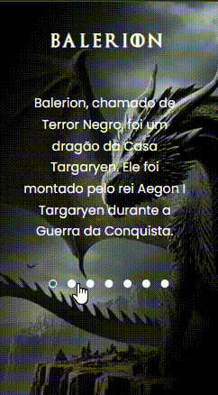

# Projeto House of the Dragon

Um projeto com personagens Dragões contendo as imagens, a descrição de cada Dragão e botões clicáveis onde são mostrados cada Dragão individualmente. Para telas de desktops, tablets e celulares 📲💻

## Tecnologias utilizadas
- HTML
- CSS
- JAVASCRIPT

## 📂 Acesso ao projeto

Você pode acessar o código fonte do projeto 
<https://github.com/denisero19/projeto-dragoes>